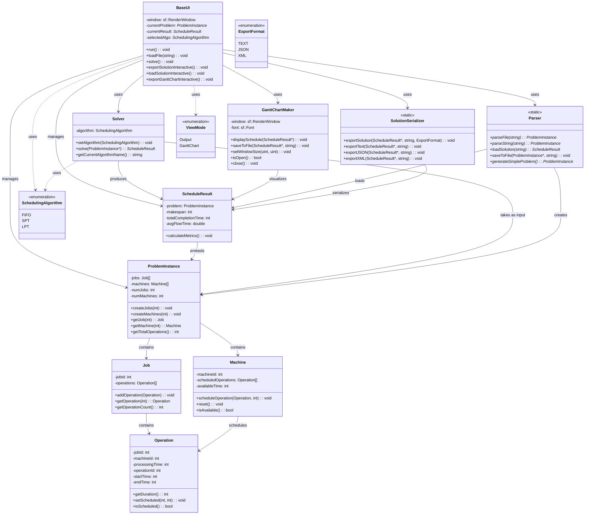

# JSSP Solver in C++ - Object-Oriented Design

This project implements a Job Shop Scheduling Problem (JSSP) solver using modern C++ with object-oriented programming principles. The application provides a graphical user interface for selecting problem instances, running different scheduling algorithms, and visualizing the results with Gantt charts.

## Features

- **Problem Loading**: Parse JSSP problem files (.jssp format)
- **Multiple Algorithms**: FIFO (First In, First Out), SPT (Shortest Processing Time), LPT (Longest Processing Time)
- **Graphical Interface**: SFML-based GUI for easy interaction
- **Visualization**: Interactive Gantt chart display with color-coded jobs
- **Export Options**: Save solutions as text, JSON, XML, and PNG images
- **File Dialog Integration**: Native system file dialogs for loading solution files
- **Comprehensive Testing**: Unit and integration tests using Google Test

## Class Architecture


## Project Structure

```
JSSP_CPP/
├── CMakeLists.txt                 # Main CMake build configuration
├── LICENSE                        # MIT License file
├── README.md                      # This file
├── REPORT.md                      # Project report/documentation
├── data/                          # Sample JSSP problem instances
│   ├── challenging_12jobs_4machines.jssp
│   ├── complex_8x8.jssp
│   ├── hard_10jobs_5machines.jssp
│   ├── medium_5x5.jssp
│   ├── simple_3x3.jssp
│   └── very_hard_7jobs_3machines.jssp
├── images/                        # UI screenshots and assets
│   ├── export_import.png
│   └── main_screen.png
├── include/                       # Header files (.hpp)
│   ├── base_ui.hpp               # Main UI class declaration
│   ├── gantt_maker.hpp           # Gantt chart visualization
│   ├── models.hpp                # Core data structures
│   ├── parser.hpp                # File parsing utilities
│   ├── README.md                 # Headers documentation
│   ├── solution_serializer.hpp   # Export functionality
│   └── solver.hpp                # Scheduling algorithms
├── src/                          # Implementation files (.cpp)
│   ├── gantt_maker.cpp          # Gantt chart implementation
│   ├── main.cpp                 # Application entry point
│   ├── models.cpp               # Data structures implementation
│   ├── parser.cpp               # File parsing implementation
│   ├── README.md                # Source files documentation
│   ├── solution_serializer.cpp  # Export implementation
│   └── solver.cpp               # Algorithm implementations
├── tests/                        # Test suite
│   ├── CMakeLists.txt           # Test build configuration
│   ├── README.md                # Test documentation
│   ├── run_tests.sh             # Test runner script
│   ├── test_data/               # Test problem instances
│   │   ├── invalid_test.jssp
│   │   ├── medium_test.jssp
│   │   └── simple_test.jssp
│   ├── test_gantt_maker.cpp     # Gantt maker tests
│   ├── test_integration.cpp     # Integration tests
│   ├── test_models.cpp          # Data model tests
│   ├── test_output.png          # Test output image
│   ├── test_parser.cpp          # Parser tests
│   └── test_solver.cpp          # Solver tests
└── ui/                          # User interface
    ├── base_ui.cpp              # Main UI implementation
    └── README.md                # UI documentation
```

### Architecture Overview

This project follows a traditional C++ library structure with clear separation of interface and implementation:

```
include/                    src/
├── models.hpp             ├── models.cpp
├── solver.hpp             ├── solver.cpp
├── parser.hpp             ├── parser.cpp
├── gantt_maker.hpp        ├── gantt_maker.cpp
├── solution_serializer.hpp├── solution_serializer.cpp
└── base_ui.hpp            └── main.cpp

ui/
└── base_ui.cpp
```

**Benefits of this structure:**
- **Faster compilation** - Changes to implementation don't require recompiling all dependent files
- **Better encapsulation** - Implementation details are hidden from users
- **Library potential** - Can create precompiled libraries for distribution
- **Maintainability** - Clear separation of interface and implementation

## Prerequisites

- C++17 compatible compiler (GCC, Clang, MSVC)
- CMake 3.10 or higher
- SFML 2.5 or higher (graphics, window, system components)
- nlohmann/json 3.2.0 or higher (for JSON export/import)

### Installing Dependencies

#### Ubuntu/Debian
```bash
sudo apt-get update
sudo apt-get install build-essential cmake libsfml-dev nlohmann-json3-dev
```

#### CentOS/RHEL/Fedora
```bash
sudo yum install gcc-c++ cmake sfml-devel json-devel
# or for newer versions:
sudo dnf install gcc-c++ cmake sfml-devel json-devel
```

#### macOS (using Homebrew)
```bash
brew install cmake sfml nlohmann-json
```

#### Windows
Use vcpkg or similar package manager:
```bash
vcpkg install sfml nlohmann-json
```

## Building the Project

1. **Clone or navigate to the project directory**
   ```bash
   cd JSSP_CPP
   ```

2. **Create build directory**
   ```bash
   mkdir build
   cd build
   ```

3. **Configure the build**
   ```bash
   cmake ..
   ```

4. **Build the project**
   ```bash
   make
   ```

The executable `JSPSolver` will be created in the build directory.

### Quick Build & Run (One-liner)
```bash
mkdir -p build && cd build && cmake .. && make && ./JSPSolver
```

## Running the GUI Application

After building, run the application:

```bash
./JSPSolver
```

### GUI Features

- **Problem Selection**: Choose from available .jssp files in the data directory
- **Algorithm Selection**: Select scheduling algorithm (FIFO, SPT, LPT)
- **Visualization**: View the generated schedule as a Gantt chart
- **Export**: Save the solution in various formats (Text, JSON, XML, PNG)

## Running Tests

To build and run the test suite:

### Option 1: Using the test runner script
```bash
cd tests
chmod +x run_tests.sh
./run_tests.sh
```

### Option 2: Manual build with tests enabled
```bash
mkdir build
cd build
cmake .. -DBUILD_TESTS=ON
make
ctest --output-on-failure
```

### Option 3: Run test executable directly
```bash
./JSSPTests
```

### Quick Test Run (One-liner)
```bash
mkdir -p build && cd build && cmake .. -DBUILD_TESTS=ON && make && ./JSSPTests
```

## Sample Problem Files

The `data/` directory contains sample JSSP instances:
- `simple_3x3.jssp` - Basic 3 jobs, 3 machines problem
- `medium_5x5.jssp` - Medium complexity problem
- `complex_8x8.jssp` - Larger problem for testing

## File Formats

### Input (.jssp files)
Standard JSSP format with processing times for each job-machine combination.

### Output Formats
- **Text**: Human-readable schedule summary
- **JSON**: Structured data for programmatic use
- **XML**: Alternative structured format
- **PNG**: Visual Gantt chart export

## Development

### Code Style
- C++17 standard
- Object-oriented design with proper encapsulation
- Smart pointers for memory management
- Comprehensive error handling
- Pythonic style commenting

### Adding New Algorithms
1. Implement algorithm in `src/solver.cpp`
2. Add corresponding header in `include/solver.hpp`
3. Add unit tests in `tests/test_solver.cpp`
4. Update UI selection in `ui/base_ui.cpp`

### Testing
- Unit tests for all core classes
- Integration tests for complete workflows
- Test coverage for edge cases and error conditions

## License
- MIT License
