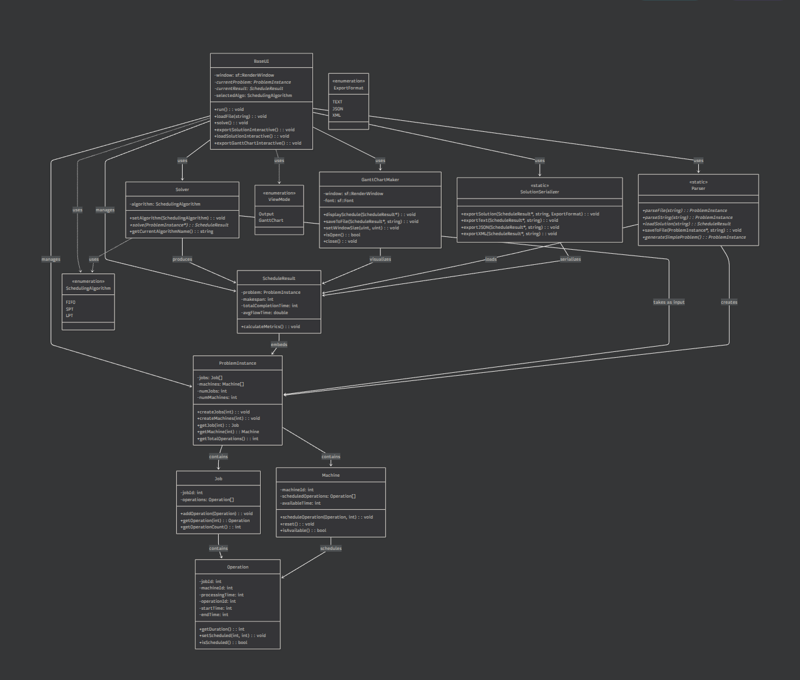

# JSSP Solver in C++ - Object-Oriented Design

This project implements a Job Shop Scheduling Problem (JSSP) solver using modern C++ with object-oriented programming principles. The application provides a graphical user interface for selecting problem instances, running different scheduling algorithms, and visualizing the results with Gantt charts.

## Features ✨

- **Problem Loading**: Parse JSSP problem files (.jssp format)
- **Multiple Algorithms**: FIFO (First In, First Out), SPT (Shortest Processing Time), LPT (Longest Processing Time)
- **Graphical Interface**: SFML-based GUI for easy interaction
- **Visualization**: Interactive Gantt chart display with color-coded jobs
- **Export Options**: Save solutions as text, JSON, XML, and PNG images
- **File Dialog Integration**: Native system file dialogs for loading solution files
- **Comprehensive Testing**: Unit and integration tests using Google Test

## Class Architecture




## Project Structure

```
JsspSolver/
├── CMakeLists.txt
├── data
│   ├── challenging_12x4.jssp
│   ├── complex_8x8.jssp
│   ├── hard_10x5.jssp
│   ├── hard_7x3.jssp
│   ├── medium_5x5.jssp
│   └── simple_3x3.jssp
├── diagram.mmd
├── images
│   ├── diagram.png
│   ├── image copy 2.png
│   ├── image copy 3.png
│   ├── image copy 4.png
│   ├── image copy 5.png
│   ├── image copy 6.png
│   ├── image copy 7.png
│   ├── image copy 8.png
│   ├── image copy.png
│   └── image.png
├── include
│   ├── base_ui.hpp
│   ├── gantt_maker.hpp
│   ├── main.hpp
│   ├── models.hpp
│   ├── parser.hpp
│   ├── README.md
│   ├── solution_serializer.hpp
│   └── solver.hpp
├── LICENSE
├── README.md
├── REPORT.md
├── src
│   ├── gantt_maker.cpp
│   ├── main.cpp
│   ├── models.cpp
│   ├── parser.cpp
│   ├── README.md
│   ├── solution_serializer.cpp
│   └── solver.cpp
├── tests
│   ├── build
│   ├── CMakeLists.txt
│   ├── README.md
│   ├── run_tests.sh
│   ├── test_gantt_maker.cpp
│   ├── test_integration.cpp
│   ├── test_models.cpp
│   ├── test_parser.cpp
│   └── test_solver.cpp
└── ui
    ├── base_ui.cpp
    └── README.md
```

### Architecture Overview

This project follows a traditional C++ library structure with clear separation of interface and implementation:

```
include/                    src/
├── models.hpp             ├── models.cpp
├── solver.hpp             ├── solver.cpp
├── parser.hpp             ├── parser.cpp
├── gantt_maker.hpp        ├── gantt_maker.cpp
├── solution_serializer.hpp├── solution_serializer.cpp
└── base_ui.hpp            └── main.cpp

ui/
└── base_ui.cpp
```

**Benefits of this structure:**
- **Faster compilation** - Changes to implementation don't require recompiling all dependent files
- **Better encapsulation** - Implementation details are hidden from users
- **Library potential** - Can create precompiled libraries for distribution
- **Maintainability** - Clear separation of interface and implementation

## Prerequisites

- C++17 compatible compiler (GCC, Clang, MSVC)
- CMake 3.10 or higher
- SFML 2.5 or higher (graphics, window, system components)
- nlohmann/json 3.2.0 or higher (for JSON export/import)

### Installing Dependencies

#### Ubuntu/Debian
```bash
sudo apt-get update
sudo apt-get install build-essential cmake libsfml-dev nlohmann-json3-dev
```

#### CentOS/RHEL/Fedora
```bash
sudo yum install gcc-c++ cmake sfml-devel json-devel
# or for newer versions:
sudo dnf install gcc-c++ cmake sfml-devel json-devel
```

#### macOS (using Homebrew)
```bash
brew install cmake sfml nlohmann-json
```

#### Windows
Use vcpkg or similar package manager:
```bash
vcpkg install sfml nlohmann-json
```

## Building the Project

1. **Clone or navigate to the project directory**
   ```bash
   cd JSSP_CPP
   ```

2. **Create build directory**
   ```bash
   mkdir build
   cd build
   ```

3. **Configure the build**
   ```bash
   cmake ..
   ```

4. **Build the project**
   ```bash
   make
   ```

The executable `JSPSolver` will be created in the build directory.

### Quick Build & Run (One-liner)
```bash
mkdir -p build && cd build && cmake .. && make && ./JSPSolver
```

## Running the GUI Application

After building, run the application:

```bash
./JSPSolver
```

### GUI Features

- **Problem Selection**: Choose from available .jssp files in the data directory
- **Algorithm Selection**: Select scheduling algorithm (FIFO, SPT, LPT)
- **Visualization**: View the generated schedule as a Gantt chart
- **Export**: Save the solution in various formats (Text, JSON, XML, PNG)

## Running Tests

To build and run the test suite:

### Using the test runner script (Recommended)
```bash
cd tests
chmod +x run_tests.sh
./run_tests.sh
```

## Sample Problem Files

The `data/` directory contains sample JSSP instances:
- **simple_3x3.jssp**
- **medium_5x5.jssp**
- **hard_7x3.jssp**
- **hard_10x5.jssp**
- **complex_8x8.jssp**
- **challenging_12x4.jssp**

## File Formats

### Input (.jssp files)
Standard JSSP format with processing times for each job-machine combination.

### Output Formats
- **Text**: Human-readable schedule summary
- **JSON**: Structured data for programmatic use
- **XML**: Alternative structured format
- **PNG**: Visual Gantt chart export

## Development

### Code Style
- C++17 standard
- Object-oriented design with proper encapsulation
- Smart pointers for memory management
- Comprehensive error handling
- Pythonic style commenting

### Adding New Algorithms
1. Implement algorithm in `src/solver.cpp`
2. Add corresponding header in `include/solver.hpp`
3. Add unit tests in `tests/test_solver.cpp`
4. Update UI selection in `ui/base_ui.cpp`

### Testing
- Unit tests for all core classes
- Integration tests for complete workflows
- Test coverage for edge cases and error conditions

## License
- MIT License
