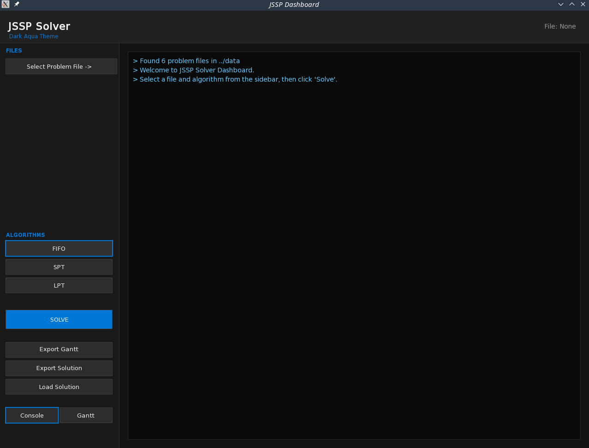

# JSSP Solver - Project Showcase

A C++ application designed to solve the **Job Shop Scheduling Problem (JSSP)** using basic algorithms and providing visual feedback via Gantt charts.

## User Interface Overview

### 1. Problem Selection
The application features a clean interface where users can select from pre-defined JSSP problems or load their own.

*The main dashboard upon startup.*

*Dropdown menu for selecting different problem instances (e.g., 5x5, 8x8, 12x4).*

---

### 2. Solving the Problem
Users can choose an algorithm to find an optimal or near-optimal schedule.

*Selecting an algorithm and executing the solver. The logs show the progress and the calculated Makespan.*

---

### 3. Visualization & Gantt Charts
The tool provides an integrated Gantt chart viewer to visualize the machine schedules.

*Interactive Gantt chart preview showing job distribution across machines over time.*

*Logs confirming the successful export of the Gantt chart as an image.*

---

### 4. Data Management & Persistence
Solutions can be exported for later use or imported to verify results.

*Exporting the calculated solution to a `.jssp` compatible format.*

*Using the file explorer to load a previously saved solution.*

*Logs confirming that the external solution was successfully parsed and loaded.*

*Directly visualizing a loaded solution without re-running the solver.*

---

### ✒️ Key Features
- **Real-Time Visualization:** Integrated Gantt chart rendering for immediate feedback.
- **Import & Export:** Support for loading problem instances and exporting both solutions and charts.
- **Action Logging:** An integrated console providing real-time logs for every action.

### 😔 Down-sides
- **Fixed Export Locations:** Solutions are saved to `~/Documents/JSSP_SOLUTIONS/` and Gantt charts to `~/Pictures/GANTT_GRAPHS/` without a choice of directory.
- **Platform Dependency:** The export system currently relies on Linux/macOS home directory structures, which may cause issues on Windows.
- **Heuristic-Only Solving:** The solver uses basic priority rules (FIFO, SPT, LPT). While fast, they don't always find the most optimal "Makespan" for complex problems.
- **No In-App Editing:** You cannot modify job or machine data directly in the UI; you have to edit the `.jssp` files manually.
- **Limited Input Formats:** Only supports the custom `.jssp` file format for loading new problems.
