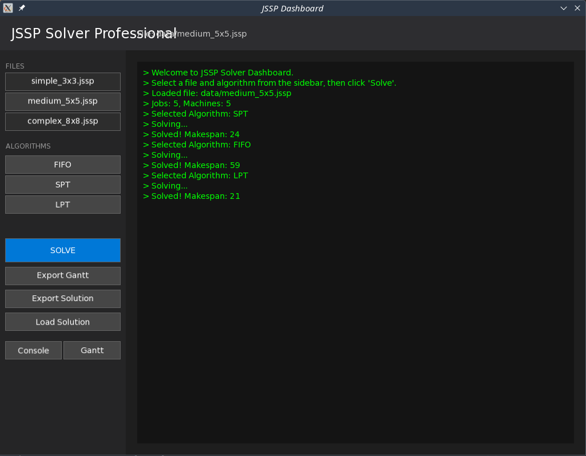
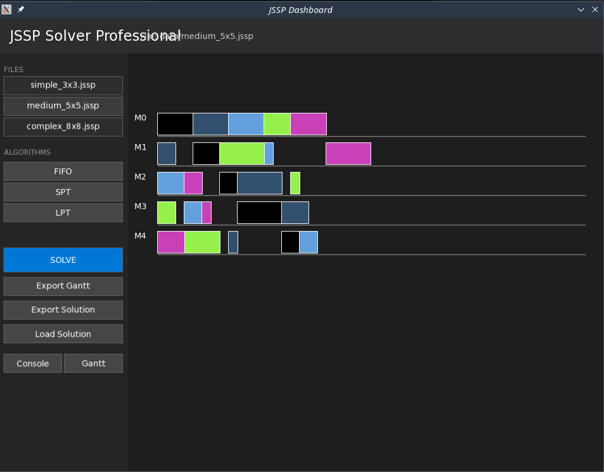
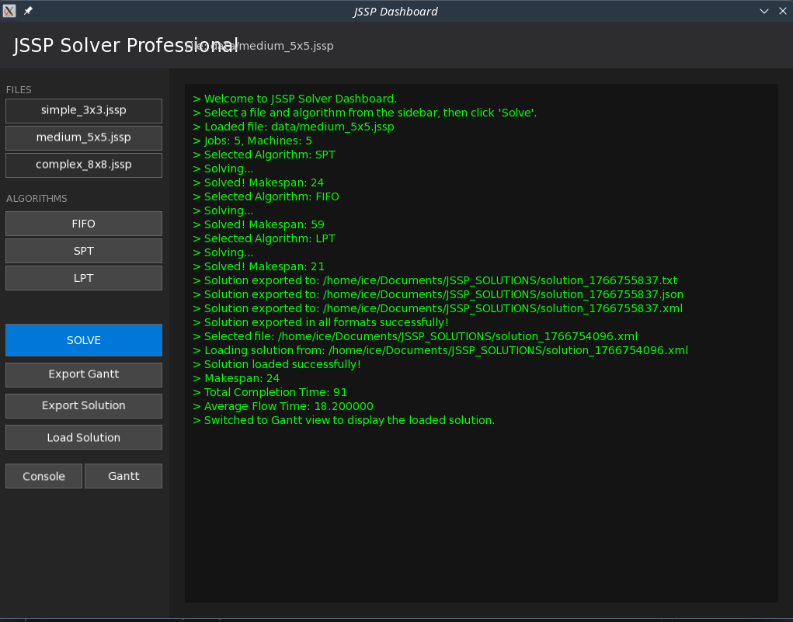

# Επίλυση JSSP - Αναφορά Εκτέλεσης

**Μάθημα:** Αντικειμενοστραφής Προγραμματισμός (Φθινόπωρο 2025-2026)  
**Ημερομηνία:** 26 Δεκεμβρίου 2025  

Αυτό το έγγραφο παρέχει μια οπτική παρουσίαση της εφαρμογής επίλυσης του Προβλήματος Προγραμματισμού Εργασιών (JSSP), παρουσιάζοντας τις βασικές λειτουργίες της: φόρτωση προβλήματος, επιλογή αλγορίθμου, οπτικοποίηση λύσης και εξαγωγή δεδομένων.

## 1. Κύρια Διεπαφή & Επιλογή Προβλήματος

Η εφαρμογή ξεκινά με μια καθαρή διεπαφή. Η πλαϊνή μπάρα στα αριστερά επιτρέπει στους χρήστες να επιλέξουν παραδείγματα προβλημάτων JSSP από τον κατάλογο `data/`.

## 2. Επίλυση και Οπτικοποίηση (Διάγραμμα Gantt)

Μετά την επιλογή ενός προβλήματος (π.χ. `simple_3x3.jssp`) και ενός αλγορίθμου (π.χ. FIFO, SPT ή LPT), η εφαρμογή υπολογίζει το πρόγραμμα και εμφανίζει ένα διαδραστικό διάγραμμα Gantt.

- **Κάθετος Άξονας:** Μηχανές (M0, M1, M2...)  
- **Οριζόντιος Άξονας:** Χρόνος  
- **Χρώματα:** Κάθε εργασία έχει ένα μοναδικό χρώμα για εύκολη διάκριση.

## 3. Μετρικές Λύσης & Εξαγωγή

Η εφαρμογή παρέχει λεπτομερείς μετρικές όπως **Makespan**, **Συνολικός Χρόνος Ολοκλήρωσης** και **Μέσος Χρόνος Ροής**. Οι χρήστες μπορούν να εξάγουν τη λύση σε διάφορες μορφές (Κείμενο, JSON, XML) ή να αποθηκεύσουν το διάγραμμα Gantt ως εικόνα.

